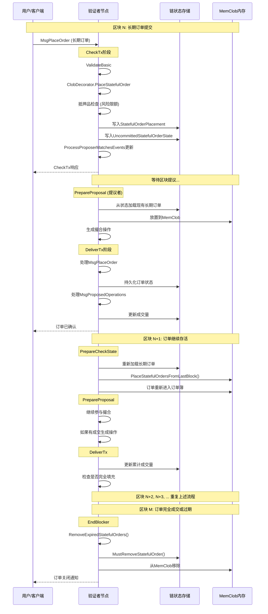

# 订单交易在多节点环境下的时序与时延分析

## 概述

本文档详细分析dYdX v4 Chain中订单交易在分布式节点环境（验证者节点和全节点）下的完整生命周期，包括详细的时序图和各阶段时延分析。

---

## 1. 节点类型与角色

### 1.1 验证者节点 (Validator Node)

**职责**：
- 参与共识投票
- 生成区块提议（轮流担任提议者）
- 执行完整的区块验证
- 运行撮合引擎生成操作队列
- 维护完整的订单簿状态

**关键特性**：
- 拥有投票权
- 执行PrepareProposal和ProcessProposal的完整逻辑
- 需要运行Oracle价格服务

### 1.2 全节点 (Full Node)

**职责**：
- 同步和验证区块
- 执行交易并维护状态
- 提供RPC/API服务
- 不参与共识投票

**关键特性**：
- 无投票权
- PrepareProposal返回空（不生成区块）
- ProcessProposal执行最小验证
- 可选择性运行Oracle服务

---

## 2. 订单类型与处理差异

### 2.1 短期订单 (Short-Term Orders)

**特征**：
- GoodTilBlock: 当前区块 + 1 到 当前区块 + 30
- 仅存在于内存中（MemClob）
- 单个交易只能包含一个短期订单
- 在CheckTx阶段即可撮合

**时延优势**：
- 低时延（CheckTx即处理）
- 快速撮合反馈

### 2.2 长期订单 (Long-Term Orders)

**特征**：
- GoodTilBlockTime: 使用时间戳
- 持久化到链状态
- 需要抵押品检查
- 跨区块有效

**时延特点**：
- 需要状态写入
- 每个区块重新加载到MemClob
- 适合长期持有的限价单

---

## 3. 完整时序图

### 3.1 短期订单：从提交到执行的完整流程

```mermaid
sequenceDiagram
    participant User as 用户/客户端
    participant Val1 as 验证者1 (提议者)
    participant Val2 as 验证者2
    participant Val3 as 验证者3
    participant FullNode as 全节点
    participant Network as P2P网络

    Note over User,FullNode: T0: 订单提交阶段
    User->>Val1: 发送MsgPlaceOrder交易
    User->>Val2: 广播到其他节点
    User->>FullNode: 广播到全节点

    Note over Val1: T1: CheckTx阶段 (并发)
    Val1->>Val1: ValidateBasic (无状态验证)
    Val1->>Val1: AnteHandler链
    Val1->>Val1: ClobDecorator.PlaceShortTermOrder
    Val1->>Val1: MemClob添加订单
    Val1->>Val1: 尝试即时撮合
    Val1->>Val1: 进入Mempool
    Val1-->>User: CheckTx响应 (30-100ms)

    Note over Val2: T1': 其他验证者并发CheckTx
    Val2->>Val2: 同样的CheckTx流程
    Val2->>Val2: 订单加入本地MemClob

    Note over FullNode: T1'': 全节点CheckTx
    FullNode->>FullNode: 同样的CheckTx流程
    FullNode->>FullNode: 订单加入本地MemClob

    Note over Val1,Val3: T2: 等待区块时间 (0.5-2秒)

    Note over Val1: T3: PrepareProposal阶段 (仅提议者)
    Val1->>Val1: 被选为提议者
    Val1->>Val1: 收集Mempool交易
    Val1->>Val1: 生成Price更新
    Val1->>Val1: 生成PremiumVotes
    Val1->>Val1: 生成Bridges事件
    Val1->>Val1: MemClob.GetOperationsToPropose()
    Val1->>Val1: 运行撮合引擎
    Val1->>Val1: 生成MsgProposedOperations
    Val1->>Val1: 构建完整区块提议

    Note over Val1,Network: T4: 区块传播 (50-200ms)
    Val1->>Network: 广播区块提议
    Network->>Val2: 传播到验证者2
    Network->>Val3: 传播到验证者3
    Network->>FullNode: 传播到全节点

    Note over Val2,FullNode: T5: ProcessProposal阶段 (所有节点)

    rect rgb(200, 220, 240)
        Note over Val2,Val3: 验证者执行完整验证
        Val2->>Val2: 解码所有交易
        Val2->>Val2: 验证交易顺序
        Val2->>Val2: 验证必需消息
        Val2->>Val2: ValidateBasic检查
        Val2->>Val2: 价格有效性验证 (需Oracle)
        Val2->>Val2: 计算MEV指标
        Val2-->>Network: ACCEPT投票

        Val3->>Val3: 同样的验证流程
        Val3-->>Network: ACCEPT投票
    end

    rect rgb(240, 220, 200)
        Note over FullNode: 全节点执行最小验证
        FullNode->>FullNode: 仅验证MsgProposedOperations
        FullNode->>FullNode: 记录MEV指标
        FullNode->>FullNode: 无条件ACCEPT
    end

    Note over Val1,Val3: T6: 共识投票 (1-3秒)
    Val2->>Network: Prevote
    Val3->>Network: Prevote
    Network->>Val1: 收集Prevotes

    Val2->>Network: Precommit
    Val3->>Network: Precommit
    Network->>Val1: 收集Precommits

    Note over Val1,FullNode: T7: 区块确认
    Val1->>Val1: 达成共识 (>2/3投票)
    Network->>FullNode: 通知区块已确认

    Note over Val1,FullNode: T8: FinalizeBlock阶段 (所有节点)

    rect rgb(220, 240, 220)
        Note over Val1: PreBlock
        Val1->>Val1: clob.PreBlocker()
        Val1->>Val1: keeper.Initialize(ctx)

        Note over Val1: BeginBlock
        Val1->>Val1: clob.BeginBlocker()
        Val1->>Val1: 初始化ProcessProposerMatchesEvents
        Val1->>Val1: ResetAllDeliveredOrderIds()

        Note over Val1: DeliverTx循环
        Val1->>Val1: 处理Price更新
        Val1->>Val1: 处理PremiumVotes
        Val1->>Val1: 处理Bridges
        Val1->>Val1: 处理其他交易
        Val1->>Val1: ProcessProposerOperations (MsgProposedOperations)
        Val1->>Val1: ├─ ValidateAndTransformRawOperations
        Val1->>Val1: ├─ ProcessInternalOperations
        Val1->>Val1: │  ├─ PersistMatchToState
        Val1->>Val1: │  ├─ 更新成交量
        Val1->>Val1: │  ├─ 更新头寸
        Val1->>Val1: │  └─ 更新余额
        Val1->>Val1: └─ GenerateProcessProposerMatchesEvents

        Note over Val1: EndBlocker
        Val1->>Val1: clob.EndBlocker()
        Val1->>Val1: PruneStateFillAmountsForShortTermOrders()
        Val1->>Val1: RemoveExpiredStatefulOrders()
        Val1->>Val1: GenerateAndPlaceTriggeredTwapSuborders()
        Val1->>Val1: MaybeTriggerConditionalOrders()
        Val1->>Val1: MustSetProcessProposerMatchesEvents()

        Note over Val1: Precommit
        Val1->>Val1: clob.Precommit()
        Val1->>Val1: ProcessStagedFinalizeBlockEvents()
        Val1->>Val1: StreamBatchUpdatesAfterFinalizeBlock()
    end

    rect rgb(220, 240, 220)
        Note over Val2,FullNode: 其他节点同步执行
        Val2->>Val2: 同样的FinalizeBlock流程
        FullNode->>FullNode: 同样的FinalizeBlock流程
    end

    Note over Val1,FullNode: T9: PrepareCheckState (下一区块准备)
    Val1->>Val1: clob.PrepareCheckState()
    Val1->>Val1: 获取本地验证者操作队列
    Val1->>Val1: 从MemClob清除已执行操作
    Val1->>Val1: PurgeInvalidMemclobState()
    Val1->>Val1: ├─ 移除完全填充的订单
    Val1->>Val1: ├─ 移除过期订单
    Val1->>Val1: └─ 移除已取消订单
    Val1->>Val1: PlaceStatefulOrdersFromLastBlock()
    Val1->>Val1: PlaceConditionalOrdersTriggeredInLastBlock()
    Val1->>Val1: ReplayOperations()
    Val1->>Val1: LiquidateSubaccountsAgainstOrderbook()
    Val1->>Val1: DeleverageSubaccounts()

    Val2->>Val2: 同样的PrepareCheckState流程
    FullNode->>FullNode: 同样的PrepareCheckState流程

    Note over Val1,FullNode: T10: 状态提交完成
    Val1-->>User: 订单成交确认 (通过Indexer)
    FullNode-->>User: API查询返回成交结果
```



### 3.2 长期订单：跨区块生命周期



---

## 4. 详细时延分析

### 4.1 时延组成与测量

订单从提交到最终确认的总时延可以分解为以下组成部分：

```
总时延 = T_network_submit + T_checkTx + T_wait_block + T_prepare +
         T_network_propose + T_process + T_consensus + T_finalize +
         T_prepare_checkstate

其中：
- T_network_submit: 网络传播到验证者
- T_checkTx: CheckTx验证和处理
- T_wait_block: 等待成为提议者或下一个区块
- T_prepare: PrepareProposal生成区块
- T_network_propose: 区块提议网络传播
- T_process: ProcessProposal验证
- T_consensus: 共识投票（Prevote + Precommit）
- T_finalize: FinalizeBlock执行
- T_prepare_checkstate: 准备下一区块CheckState
```

### 4.2 各阶段详细时延

#### 4.2.1 网络传播时延 (T_network_submit)

**影响因素**：
- 节点地理分布
- 网络带宽和延迟
- P2P连接数量
- 交易大小

**典型值**：
- 同数据中心: 1-5ms
- 同地区: 10-30ms
- 跨地区: 50-200ms
- 全球分布: 100-500ms

**优化策略**：
- 连接到地理上接近的验证者
- 使用专用网络连接
- 增加P2P连接数
- 压缩交易数据

#### 4.2.2 CheckTx时延 (T_checkTx)

**处理步骤与时延**：

```
┌─────────────────────────────────────────────────┐
│ CheckTx Pipeline (串行处理单个交易)              │
├─────────────────────────────────────────────────┤
│ 1. 反序列化交易                    ~0.1-0.5ms   │
│ 2. ValidateBasic                  ~0.1-0.2ms   │
│ 3. AnteHandler链                                │
│    ├─ SetUpContext                ~0.05ms      │
│    ├─ ReplayProtection            ~0.1ms       │
│    ├─ SigVerification             ~0.5-2ms     │
│    ├─ ClobRateLimitDecorator      ~0.1ms       │
│    └─ ClobDecorator                ~1-5ms      │
│       ├─ 订单验证                 ~0.2ms       │
│       ├─ MemClob操作              ~0.5-2ms     │
│       └─ 尝试撮合                 ~0.5-3ms     │
├─────────────────────────────────────────────────┤
│ 短期订单总计:                      2-10ms       │
│ 长期订单总计 (含状态写入):         5-20ms       │
└─────────────────────────────────────────────────┘
```

**长期订单额外开销**：
- 抵押品检查: 1-3ms（需读取账户状态和头寸）
- 状态写入: 2-10ms（取决于存储后端）
- 风险计算: 0.5-2ms

**并发处理**：
- CheckTx在CheckState上并发执行
- 但需要锁保护MemClob结构
- 实际并发度受锁竞争限制

#### 4.2.3 等待区块时延 (T_wait_block)

**影响因素**：
- 区块时间配置（dYdX v4约1秒）
- 交易到达时机
- 验证者轮换策略

**概率分布**：

```
假设区块时间 = 1秒，提议者轮换

如果交易在区块周期中随机到达：
- 最小等待: ~0秒 (刚好赶上当前区块)
- 最大等待: ~1秒 (刚错过上一个区块)
- 平均等待: ~0.5秒
- P50: ~0.5秒
- P90: ~0.9秒
- P99: ~0.99秒

实际情况可能更复杂：
- 如果mempool已满，可能需要等待多个区块
- 如果Gas价格过低，可能被延迟
- 高优先级交易可能减少等待
```

#### 4.2.4 PrepareProposal时延 (T_prepare)

**处理步骤**：

```
┌──────────────────────────────────────────────────┐
│ PrepareProposal Pipeline (仅提议者执行)          │
├──────────────────────────────────────────────────┤
│ 1. 收集Mempool交易                ~1-5ms         │
│ 2. 生成Price更新交易              ~0.5-2ms       │
│ 3. 生成PremiumVotes交易           ~0.2-1ms       │
│ 4. 生成Bridges交易                ~0.1-0.5ms     │
│ 5. MemClob.GetOperationsToPropose ~10-50ms       │
│    ├─ 遍历所有ClobPair                           │
│    ├─ 价格时间优先排序                           │
│    ├─ 执行撮合算法                               │
│    └─ 生成操作队列                               │
│ 6. 序列化MsgProposedOperations    ~1-5ms         │
│ 7. 构建最终交易列表               ~0.5-2ms       │
├──────────────────────────────────────────────────┤
│ 总计 (取决于订单数量):             15-70ms       │
│   - 少量订单 (<100):               15-30ms       │
│   - 中等订单 (100-1000):           30-50ms       │
│   - 大量订单 (>1000):              50-70ms       │
└──────────────────────────────────────────────────┘
```

**性能影响因素**：
- MemClob中的订单数量
- ClobPair数量（交易对数量）
- 订单簿深度
- 撮合算法复杂度

**优化措施**：
- 限制单个区块的操作数量
- 优化订单簿数据结构（红黑树/跳表）
- 预计算常用撮合路径

#### 4.2.5 区块传播时延 (T_network_propose)

**影响因素**：
- 区块大小（包含的交易数量）
- 网络拓扑
- 验证者节点数量

**典型值**：

```
区块大小对传播时延的影响：

小区块 (<100KB):
├─ 同数据中心: 5-10ms
├─ 同地区: 20-50ms
├─ 跨地区: 50-150ms
└─ 全球: 100-300ms

中等区块 (100-500KB):
├─ 同数据中心: 10-20ms
├─ 同地区: 30-80ms
├─ 跨地区: 80-200ms
└─ 全球: 150-500ms

大区块 (500KB-2MB):
├─ 同数据中心: 20-50ms
├─ 同地区: 50-150ms
├─ 跨地区: 150-400ms
└─ 全球: 300-1000ms
```

**dYdX v4特殊考虑**：
- MsgProposedOperations可能很大（包含所有撮合操作）
- 使用Protobuf编码，相对紧凑
- 可能需要压缩传输

#### 4.2.6 ProcessProposal时延 (T_process)

**验证者节点处理**：

```
┌──────────────────────────────────────────────────┐
│ ProcessProposal Pipeline (验证者)                │
├──────────────────────────────────────────────────┤
│ 1. 接收并解码区块                 ~1-5ms         │
│ 2. 解码所有交易                   ~2-10ms        │
│ 3. 验证交易顺序                   ~0.1ms         │
│ 4. 验证必需消息                   ~0.2ms         │
│ 5. ValidateBasic所有消息          ~1-5ms         │
│ 6. 价格有效性验证                 ~2-10ms        │
│    └─ 与本地Oracle价格比较                       │
│ 7. MEV指标计算 (可选)             ~5-20ms        │
├──────────────────────────────────────────────────┤
│ 验证者总计:                        10-50ms       │
└──────────────────────────────────────────────────┘
```

**全节点处理**：

```
┌──────────────────────────────────────────────────┐
│ ProcessProposal Pipeline (全节点)                │
├──────────────────────────────────────────────────┤
│ 1. 接收并解码区块                 ~1-5ms         │
│ 2. 仅验证MsgProposedOperations    ~1-3ms         │
│ 3. MEV指标记录 (可选)             ~2-10ms        │
│ 4. 无条件返回ACCEPT               ~0.1ms         │
├──────────────────────────────────────────────────┤
│ 全节点总计:                        5-20ms        │
└──────────────────────────────────────────────────┘
```

**关键差异**：
- 验证者需要完整验证（防止恶意提议）
- 全节点信任验证者共识结果
- 价格验证是主要时延来源（需要本地Oracle状态）

#### 4.2.7 共识投票时延 (T_consensus)

**CometBFT共识流程**：

```
┌──────────────────────────────────────────────────────┐
│ Tendermint/CometBFT共识流程                          │
├──────────────────────────────────────────────────────┤
│ Round 0:                                             │
│   Propose          提议者广播区块       ~T_propose  │
│   ↓                                                  │
│   Prevote          验证者广播预投票     ~200-500ms  │
│   │ ├─ 本地验证                         ~50ms       │
│   │ ├─ 签名                             ~1-5ms      │
│   │ └─ 广播+收集                        ~150-400ms  │
│   ↓                                                  │
│   Precommit        验证者广播预提交     ~200-500ms  │
│   │ ├─ 收集>2/3 Prevote                 ~100-300ms  │
│   │ ├─ 签名Precommit                    ~1-5ms      │
│   │ └─ 广播+收集                        ~100-200ms  │
│   ↓                                                  │
│   Commit           达成共识             ~0.1ms      │
├──────────────────────────────────────────────────────┤
│ 理想情况 (单轮):                        500-1200ms  │
│ 2轮共识 (有分歧):                       1000-2400ms │
│ 3轮或更多 (网络问题):                   1500ms+     │
└──────────────────────────────────────────────────────┘
```

**影响共识时延的因素**：

1. **验证者数量** (N)：
   - 投票消息数量 ∝ N²
   - 需要收集 >2/3 投票
   - dYdX v4主网验证者数量：~60-100

2. **网络延迟**：
   - 验证者地理分布
   - P2P连接质量
   - 网络分区风险

3. **投票超时配置**：
   ```
   TimeoutPropose:    3秒
   TimeoutPrevote:    1秒
   TimeoutPrecommit:  1秒
   TimeoutCommit:     0秒 (立即)
   ```

4. **拜占庭节点**：
   - 最多容忍 <1/3 拜占庭节点
   - 恶意节点可能延迟但不能阻止共识

**实际测量数据** (基于公开的Cosmos SDK链)：
- Cosmos Hub: 平均出块时间 6-7秒
- Osmosis: 平均出块时间 5-6秒
- dYdX v4目标: ~1秒 (优化配置)

#### 4.2.8 FinalizeBlock时延 (T_finalize)

**完整执行流程**：

```
┌──────────────────────────────────────────────────────┐
│ FinalizeBlock Pipeline (所有节点)                    │
├──────────────────────────────────────────────────────┤
│ PreBlock:                                            │
│   └─ clob.PreBlocker()            ~0.5-2ms          │
│                                                      │
│ BeginBlock:                                          │
│   └─ clob.BeginBlocker()          ~1-5ms            │
│                                                      │
│ DeliverTx (循环处理所有交易):                         │
│   ├─ Price更新                    ~1-3ms            │
│   ├─ PremiumVotes                 ~0.5-2ms          │
│   ├─ Bridges                      ~0.5-2ms          │
│   ├─ 其他交易 (变量)              ~N*2-10ms         │
│   └─ MsgProposedOperations        ~20-100ms         │
│      ├─ 验证操作                  ~5-20ms           │
│      ├─ ProcessInternalOperations ~10-60ms          │
│      │  ├─ 每个撮合操作          ~0.1-0.5ms        │
│      │  ├─ 状态写入 (批量)       ~5-20ms           │
│      │  └─ 事件生成              ~2-10ms           │
│      └─ GenerateEvents            ~3-10ms           │
│                                                      │
│ EndBlocker:                                          │
│   ├─ PruneStateFillAmounts        ~2-10ms           │
│   ├─ RemoveExpiredOrders          ~1-5ms            │
│   ├─ TriggerTwapSuborders         ~2-10ms           │
│   ├─ TriggerConditionalOrders     ~5-20ms           │
│   └─ SetProcessProposerEvents     ~0.5ms            │
│                                                      │
│ Precommit:                                           │
│   ├─ ProcessStagedEvents          ~5-20ms           │
│   └─ StreamBatchUpdates           ~10-50ms          │
├──────────────────────────────────────────────────────┤
│ 总计 (取决于交易数量和撮合复杂度):                   │
│   - 轻量区块:                      50-150ms         │
│   - 中等区块:                      150-300ms        │
│   - 重量区块 (大量撮合):           300-500ms        │
└──────────────────────────────────────────────────────┘
```

**关键性能瓶颈**：

1. **状态写入**：
   - 使用LevelDB/RocksDB
   - 批量写入优化
   - 写入时延：2-20ms

2. **ProcessInternalOperations**：
   - 处理所有撮合结果
   - 更新多个账户状态
   - 计算费用和结算

3. **事件生成**：
   - 为Indexer生成事件
   - Protobuf序列化
   - 流式传输 (如果启用)

#### 4.2.9 PrepareCheckState时延 (T_prepare_checkstate)

**重要性**：
- 为下一个区块准备CheckState
- 同步MemClob状态
- 处理清算和强制平仓

**处理流程**：

```
┌──────────────────────────────────────────────────────┐
│ PrepareCheckState Pipeline                           │
├──────────────────────────────────────────────────────┤
│ 1. 获取本地验证者操作队列         ~1-5ms            │
│ 2. 从MemClob清除已执行操作        ~5-20ms           │
│ 3. PurgeInvalidMemclobState       ~10-50ms           │
│    ├─ 移除完全填充订单                               │
│    ├─ 移除过期订单                                   │
│    └─ 移除已取消订单                                 │
│ 4. PlaceStatefulOrders (post-only) ~10-50ms          │
│    └─ 从状态加载长期订单                             │
│ 5. PlaceConditionalOrders         ~5-30ms            │
│ 6. ReplayOperations (post-only)   ~5-20ms            │
│ 7. LiquidateSubaccounts           ~20-100ms          │
│    ├─ 识别抵押不足账户                               │
│    ├─ 生成清算订单                                   │
│    └─ 执行清算撮合                                   │
│ 8. DeleverageSubaccounts          ~10-50ms           │
│ 9. GateWithdrawals                ~1-5ms             │
│ 10. PlaceStatefulOrders (full)    ~10-50ms           │
│ 11. PlaceConditionalOrders (full) ~5-30ms            │
│ 12. ReplayOperations (full)       ~5-20ms            │
│ 13. InitializeNewStreams          ~5-20ms            │
├──────────────────────────────────────────────────────┤
│ 总计 (取决于订单和清算数量):                         │
│   - 正常情况:                      100-300ms        │
│   - 大量清算:                      300-600ms        │
│   - 极端市场:                      600-1000ms       │
└──────────────────────────────────────────────────────┘
```

**关键点**：
- PrepareCheckState与区块提交并行执行
- 不计入用户感知的订单确认时延
- 但影响下一个区块的CheckTx准备度

### 4.3 端到端时延汇总

#### 4.3.1 短期订单 - 最佳情况

```
场景：验证者节点就是下一个提议者，网络条件良好

T_network_submit:       10ms   (本地或同数据中心)
T_checkTx:              5ms    (快速验证和MemClob)
T_wait_block:           0ms    (立即成为提议者)
T_prepare:              20ms   (中等订单量)
T_network_propose:      30ms   (小区块，同地区)
T_process:              15ms   (验证者快速验证)
T_consensus:            600ms  (单轮共识)
T_finalize:             150ms  (中等区块)
─────────────────────────────────────────────
总计:                   830ms  ≈ 0.83秒

用户感知时延 (到CheckTx响应):  15ms
用户确认时延 (到最终确认):     830ms
```

#### 4.3.2 短期订单 - 典型情况

```
场景：需要等待下一个区块，跨地区网络

T_network_submit:       100ms  (跨地区)
T_checkTx:              8ms    (正常验证)
T_wait_block:           500ms  (平均等待半个区块)
T_prepare:              30ms   (正常订单量)
T_network_propose:      80ms   (中等区块，跨地区)
T_process:              25ms   (正常验证)
T_consensus:            800ms  (典型共识时间)
T_finalize:             200ms  (正常执行)
─────────────────────────────────────────────
总计:                   1743ms ≈ 1.74秒

用户感知时延 (到CheckTx响应):  108ms
用户确认时延 (到最终确认):     1.74秒
```

#### 4.3.3 短期订单 - 最坏情况

```
场景：全球分布验证者，网络拥堵，共识需要多轮

T_network_submit:       300ms  (全球网络)
T_checkTx:              15ms   (MemClob竞争)
T_wait_block:           900ms  (刚错过上一个区块)
T_prepare:              60ms   (大量订单)
T_network_propose:      200ms  (大区块，全球)
T_process:              50ms   (复杂验证)
T_consensus:            1500ms (2轮共识)
T_finalize:             400ms  (大量撮合)
─────────────────────────────────────────────
总计:                   3425ms ≈ 3.43秒

用户感知时延 (到CheckTx响应):  315ms
用户确认时延 (到最终确认):     3.43秒
```

#### 4.3.4 长期订单 - 首次确认

```
场景：订单提交并在状态中持久化

CheckTx阶段额外开销:    +10ms  (抵押品检查+状态写入)
其他阶段类似短期订单

典型总时延:             1.75秒 (vs 1.74秒短期)
用户感知时延:           118ms  (vs 108ms短期)
```

#### 4.3.5 长期订单 - 后续区块撮合

```
长期订单在后续区块中的撮合：

每个区块：
├─ PrepareCheckState重新加载:    20ms
├─ PrepareProposal参与撮合:      (包含在T_prepare)
└─ DeliverTx更新成交量:          (包含在T_finalize)

对用户透明，无额外感知时延
```

### 4.4 时延优化建议

#### 4.4.1 应用层优化

**1. 优化CheckTx处理**：
```go
// 示例：批量验证签名
func BatchVerifySignatures(txs []Tx) error {
    // 使用并行签名验证
    // 可减少50-70%的签名验证时延
}

// 示例：缓存频繁访问的状态
type CachedStateReader struct {
    cache map[string][]byte
    store sdk.KVStore
}
```

**2. 优化MemClob数据结构**：
```
当前: map[Subticks]*Level (需要遍历)
优化: 使用跳表或红黑树
     O(log n)查找最佳买卖价

当前: 订单链表
优化: 使用优先队列
     O(1)获取最高优先级订单
```

**3. 减少状态访问**：
```
- 批量读取账户状态
- 缓存订单簿快照
- 延迟写入（在EndBlocker批量提交）
```

#### 4.4.2 共识层优化

**1. 调整超时参数**：
```toml
[consensus]
timeout_propose = "1s"      # 当前3s，可优化
timeout_prevote = "500ms"   # 当前1s
timeout_precommit = "500ms" # 当前1s
```

**2. 优化区块传播**：
```
- 使用Compact Block Relay（仅传输交易ID）
- 实现Block Parts Cache
- 优化P2P拓扑（优先连接低延迟节点）
```

**3. 并行验证**：
```go
// ProcessProposal中并行验证多个组件
go validatePrices(ctx, priceMsg)
go validateOperations(ctx, opsMsg)
go validateOtherTxs(ctx, otherTxs)
```

#### 4.4.3 网络层优化

**1. CDN和边缘节点**：
- 在主要地区部署边缘节点
- 用户连接最近的节点提交交易

**2. 专用网络**：
- 验证者间建立专用高速连接
- 使用QUIC协议（更快的连接建立）

**3. 交易压缩**：
```
原始交易: ~500 bytes
Gzip压缩: ~200 bytes (60%压缩率)
```

#### 4.4.4 架构优化

**1. 分层撮合**：
```
Layer 1 (链上): 最终结算
Layer 2 (optimistic): 乐观撮合，后续最终确认

用户体验:
- CheckTx返回乐观成交: 10-100ms
- 最终链上确认: 1-3秒
```

**2. 并行链**：
```
为不同的ClobPair使用独立的应用链
减少单链拥堵
```

**3. 预确认机制**：
```
部分验证者提供预确认服务
收取额外费用
风险：可能被最终区块推翻
```

---

## 5. 时延对比分析

### 5.1 与中心化交易所对比

```
┌────────────────────────────────────────────────────┐
│ 指标           │ dYdX v4   │ 币安      │ Coinbase  │
├────────────────────────────────────────────────────┤
│ 订单确认       │ ~100ms    │ <10ms     │ <50ms     │
│ 最终确认       │ 1-3秒     │ N/A*      │ N/A*      │
│ 撮合时延       │ 1-3秒     │ <100ms    │ <200ms    │
│ 取消确认       │ ~100ms    │ <10ms     │ <50ms     │
│ 最终性保证     │ 拜占庭容错 │ 无**      │ 无**      │
│ 透明度         │ 完全透明   │ 不透明    │ 不透明    │
└────────────────────────────────────────────────────┘

* 中心化交易所没有区块链最终性概念
** 依赖中心化系统保证，可被回滚
```

### 5.2 与其他DEX对比

```
┌──────────────────────────────────────────────────────────┐
│ DEX类型        │ 代表项目    │ 订单确认  │ 最终确认      │
├──────────────────────────────────────────────────────────┤
│ AMM            │ Uniswap     │ N/A       │ 12秒(ETH)     │
│ AMM            │ Pancake     │ N/A       │ 3秒(BSC)      │
│ 订单簿(L2)     │ dYdX v3     │ <100ms    │ 15分钟(ETH)   │
│ 订单簿(链)     │ dYdX v4     │ ~100ms    │ 1-3秒         │
│ 订单簿(链)     │ Serum       │ ~200ms    │ 0.4秒(Solana) │
│ 混合           │ Synthetix   │ N/A       │ 15秒(OPT)     │
└──────────────────────────────────────────────────────────┘
```

**分析**：
- dYdX v4在DEX中实现了较低的时延
- 牺牲了部分中心化交易所的极致性能
- 获得了去中心化和透明度优势
- Solana链更快但安全性和去中心化程度较低

### 5.3 不同订单类型时延对比

```
┌─────────────────────────────────────────────────────┐
│ 订单类型     │ CheckTx  │ 最终确认 │ Gas成本      │
├─────────────────────────────────────────────────────┤
│ 短期限价单   │ 5-10ms   │ 1-3秒    │ 低           │
│ 长期限价单   │ 10-20ms  │ 1-3秒    │ 中           │
│ 条件订单     │ 10-20ms  │ 触发后1-3秒│ 中         │
│ TWAP订单     │ 10-20ms  │ 分批执行  │ 高 (多次)   │
│ 市价单(IOC) │ 5-10ms   │ 1-3秒    │ 低           │
│ 批量取消     │ 3-8ms    │ 1-3秒    │ 极低         │
└─────────────────────────────────────────────────────┘
```

---

## 6. 监控与测量

### 6.1 关键性能指标 (KPI)

**链上指标**：
```
1. 区块时间
   - 目标: 1秒
   - 监控: 滑动窗口平均值
   - 告警: >1.5秒

2. 交易处理时延
   - CheckTx时延: P50, P90, P99
   - DeliverTx时延: P50, P90, P99

3. 订单撮合时延
   - 提交到包含区块: P50, P90, P99
   - 提交到最终确认: P50, P90, P99

4. MemClob性能
   - 订单数量
   - 撮合操作数/区块
   - MemClob操作时延

5. 共识指标
   - 投票延迟
   - 轮次数/区块
   - 超时次数
```

**系统指标**：
```
1. CPU使用率
   - PrepareProposal CPU
   - ProcessProposal CPU
   - DeliverTx CPU

2. 内存使用
   - MemClob内存占用
   - CheckState大小
   - DeliverState大小

3. 磁盘I/O
   - 状态写入速率
   - 状态读取速率
   - WAL写入速率

4. 网络I/O
   - P2P流量
   - 区块传播时间
   - 交易广播时间
```

### 6.2 监控工具

**Prometheus指标**：
```yaml
# 示例Prometheus配置
- job_name: 'dydx-validator'
  metrics_path: '/metrics'
  static_configs:
    - targets: ['validator:26660']

# 关键指标
- tendermint_consensus_block_interval_seconds
- tendermint_mempool_size
- tendermint_consensus_rounds
- dydx_clob_memclob_orders
- dydx_clob_matches_per_block
- dydx_clob_checkTx_duration_seconds
```

**Grafana仪表盘**：
```
面板1: 区块生产
  - 区块高度趋势
  - 区块时间分布
  - 区块大小趋势

面板2: 订单处理
  - 订单提交速率
  - 撮合成功率
  - 订单簿深度

面板3: 性能分析
  - CheckTx时延热图
  - DeliverTx时延热图
  - 共识轮次分布

面板4: 系统资源
  - CPU/内存/磁盘使用率
  - 网络流量
  - Goroutine数量
```

### 6.3 分布式追踪

**OpenTelemetry集成**：
```go
// 示例：为订单处理添加追踪
func (k Keeper) PlaceShortTermOrder(ctx sdk.Context, order Order) error {
    ctx, span := tracer.Start(ctx, "PlaceShortTermOrder")
    defer span.End()

    // 子span
    _, validateSpan := tracer.Start(ctx, "ValidateOrder")
    err := k.ValidateOrder(ctx, order)
    validateSpan.End()

    _, memclobSpan := tracer.Start(ctx, "MemClobPlace")
    k.MemClob.PlaceOrder(ctx, order)
    memclobSpan.End()

    // ... 更多操作
    return nil
}
```

**追踪关键路径**：
```
Trace: OrderLifecycle
├─ Span: NetworkReceive (10ms)
├─ Span: CheckTx (8ms)
│  ├─ Span: Deserialize (0.5ms)
│  ├─ Span: ValidateBasic (0.2ms)
│  ├─ Span: AnteHandler (2ms)
│  └─ Span: ClobDecorator (5ms)
│     ├─ Span: PlaceOrder (2ms)
│     └─ Span: AttemptMatch (3ms)
├─ Span: WaitBlock (500ms)
├─ Span: PrepareProposal (30ms)
├─ Span: Consensus (800ms)
└─ Span: FinalizeBlock (200ms)
   ├─ Span: BeginBlock (2ms)
   ├─ Span: DeliverTxs (180ms)
   │  └─ Span: ProcessOperations (150ms)
   └─ Span: EndBlock (18ms)

Total: 1548ms
```

---

## 7. 故障场景与时延影响

### 7.1 网络分区

**场景**：验证者网络分区（例如跨大西洋海底光缆中断）

**影响**：
```
正常共识: 800ms
分区后:
├─ 如果>2/3验证者在同一分区: 继续正常 (800-1200ms)
├─ 如果验证者分散: 需要多轮共识 (1500-3000ms)
└─ 如果<2/3在任一分区: 链停止 (无限时延)

恢复后:
└─ 重新同步和追赶 (取决于停止时长)
```

### 7.2 验证者宕机

**场景**：部分验证者节点宕机

**影响**：
```
宕机<1/3投票权:
├─ 共识正常 (800-1000ms)
└─ 轻微增加投票收集时间

宕机≈1/3投票权:
├─ 共识变慢 (1000-2000ms)
├─ 更容易需要多轮
└─ 接近安全边界

宕机>1/3投票权:
└─ 链停止 (无法达成共识)
```

### 7.3 Mempool拥堵

**场景**：短时间内大量订单提交

**影响**：
```
Mempool正常 (<1000 txs):
├─ CheckTx: 5-10ms
└─ 等待区块: 0.5秒

Mempool拥堵 (1000-5000 txs):
├─ CheckTx: 10-30ms (锁竞争)
├─ 等待区块: 1-2秒 (优先级排序)
└─ 部分交易可能被丢弃

Mempool满 (>5000 txs):
├─ CheckTx: 30-100ms
├─ 等待区块: 2-10秒
└─ 低优先级交易被拒绝
```

### 7.4 极端市场波动

**场景**：价格剧烈波动导致大量清算

**影响**：
```
正常市场:
└─ PrepareCheckState: 100-300ms

大量清算:
├─ PrepareCheckState: 300-1000ms
│  ├─ LiquidateSubaccounts计算密集
│  ├─ 生成大量清算订单
│  └─ 复杂的撮合计算
├─ PrepareProposal: 50-150ms (更多操作)
└─ FinalizeBlock: 300-800ms (更多状态更新)

区块时间可能延长至: 2-4秒
```

---

## 8. 未来优化方向

### 8.1 并行执行

**提案**：并行处理不冲突的订单

```
当前: 串行处理所有订单
优化:
├─ 识别独立的ClobPair
├─ 并行撮合不同交易对
└─ 并行更新不冲突的账户

潜在收益:
├─ PrepareProposal: -30-50%
├─ ProcessInternalOperations: -40-60%
└─ 总体区块时间: -20-40%
```

### 8.2 状态通道

**提案**：高频交易者使用状态通道

```
流程:
1. 用户在链上锁定资金
2. 在状态通道内进行高频交易
3. 定期结算到链上

优势:
├─ 通道内交易: <10ms
├─ 无Gas费用
└─ 最终链上结算保证

挑战:
├─ 流动性碎片化
└─ 用户体验复杂度
```

### 8.3 异步共识

**提案**：解耦撮合和共识

```
当前: 撮合 → 共识 → 执行 (串行)
优化:
├─ 撮合引擎持续运行
├─ 定期快照到链上
└─ 乐观确认 + 最终确认

潜在收益:
├─ 用户感知时延: <100ms (乐观)
├─ 最终确认: 1-3秒 (不变)
└─ 吞吐量提升: 2-5x
```

### 8.4 硬件加速

**提案**：使用专用硬件加速关键操作

```
加速目标:
├─ 签名验证: FPGA加速 (-70%)
├─ 撮合引擎: ASIC优化 (-80%)
└─ 状态merkle树: GPU加速 (-50%)

实现挑战:
├─ 去中心化程度降低
├─ 硬件成本
└─ 开发复杂度
```

---

## 9. 总结

### 9.1 关键发现

1. **端到端时延**：
   - 最佳情况：~830ms
   - 典型情况：~1.74秒
   - 最坏情况：~3.43秒

2. **主要时延来源**：
   - 共识投票：占比最大（35-45%）
   - 等待区块：占比显著（20-30%）
   - FinalizeBlock：占比中等（10-20%）
   - 网络传播：占比较小（5-15%）

3. **节点类型差异**：
   - 验证者：执行完整流程，承担共识责任
   - 全节点：最小验证，信任共识结果
   - 时延差异：验证者ProcessProposal约2-3倍全节点

4. **订单类型影响**：
   - 短期订单：更低的CheckTx时延
   - 长期订单：额外的状态操作开销
   - 差异：约5-15ms（在总时延中占比小）

### 9.2 优化优先级

**高优先级**：
1. 优化共识参数（立即见效）
2. 改进网络拓扑（中等难度）
3. 实现批量验证（高收益）

**中优先级**：
4. 优化MemClob数据结构（需要重构）
5. 并行处理独立交易对（架构改动）
6. 实现乐观撮合（用户体验提升）

**低优先级**：
7. 状态通道（复杂度高）
8. 硬件加速（去中心化权衡）

### 9.3 监控建议

**必须监控**：
- 区块时间（目标1秒，告警>1.5秒）
- CheckTx时延（目标<10ms，告警>50ms）
- 共识轮次（目标1轮，告警>2轮）

**应该监控**：
- MemClob订单数量
- 撮合操作数/区块
- PrepareCheckState时延

**可选监控**：
- MEV指标
- 订单簿深度
- Gas使用统计

---

## 附录

### A. 术语表

- **CheckTx**: 交易进入Mempool前的验证阶段
- **DeliverTx**: 交易在区块中最终执行的阶段
- **MemClob**: 内存中的中央限价订单簿
- **PrepareProposal**: 提议者准备区块的ABCI回调
- **ProcessProposal**: 验证者验证区块提议的ABCI回调
- **FinalizeBlock**: 执行区块的ABCI回调
- **PrepareCheckState**: 为下一区块准备CheckState的ABCI回调
- **Prevote/Precommit**: Tendermint共识的两阶段投票
- **GoodTilBlock**: 短期订单的有效期（区块高度）
- **GoodTilBlockTime**: 长期订单的有效期（时间戳）

### B. 相关文件索引

**订单处理核心**：
- [protocol/x/clob/ante/clob.go](protocol/x/clob/ante/clob.go) - CheckTx订单处理
- [protocol/x/clob/keeper/process_operations.go](protocol/x/clob/keeper/process_operations.go) - 撮合操作处理
- [protocol/x/clob/memclob/memclob.go](protocol/x/clob/memclob/memclob.go) - 内存订单簿

**ABCI回调**：
- [protocol/x/clob/abci.go](protocol/x/clob/abci.go) - PreBlocker, BeginBlocker, EndBlocker
- [protocol/app/prepare/prepare_proposal.go](protocol/app/prepare/prepare_proposal.go) - PrepareProposal
- [protocol/app/process/process_proposal.go](protocol/app/process/process_proposal.go) - ProcessProposal

**节点类型处理**：
- [protocol/app/prepare/full_node_prepare_proposal.go](protocol/app/prepare/full_node_prepare_proposal.go) - 全节点PrepareProposal
- [protocol/app/process/full_node_process_proposal.go](protocol/app/process/full_node_process_proposal.go) - 全节点ProcessProposal

### C. 参考资料

1. [CometBFT ABCI++ Specification](https://docs.cometbft.com/v0.38/spec/abci/)
2. [dYdX v4 Technical Architecture](https://dydx.exchange/blog/v4-technical-architecture-overview)
3. [Cosmos SDK Documentation](https://docs.cosmos.network/)
4. [Tendermint Consensus Algorithm](https://arxiv.org/abs/1807.04938)
